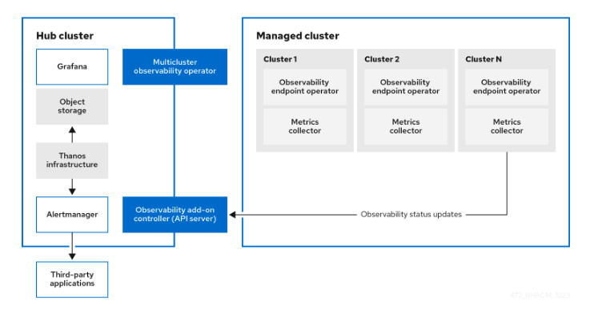
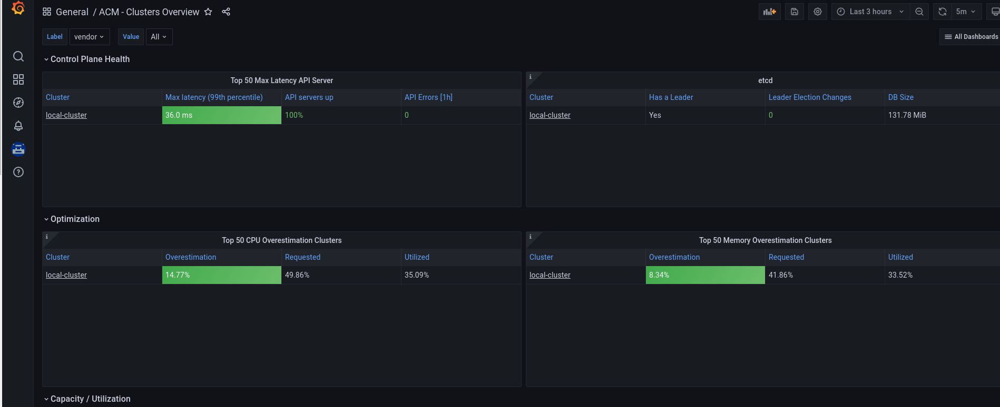
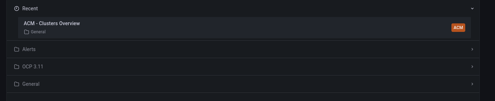
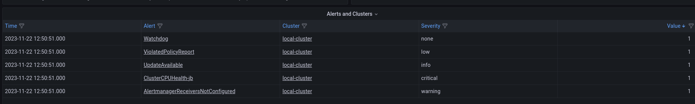
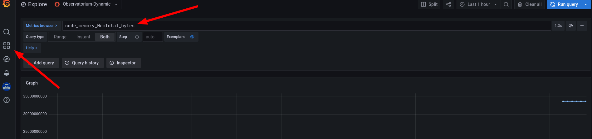

# Configurando la observabilidad de ACM en Azure y creando dashboards personalizados en Grafana

Con el módulo de observabilidad de ACM es posible tener una mayor visibilidad de los clusters lo que  puede ayudar a mejorar el coste y prevenir eventos inesperados.

Por defecto el módulo de observabilidad se intala con el operador de ACM pero no está habilitado.

Cuando se habilita ```observability-endpoint-operator``` se despliega un ```observability-endpoint-operator``` automáticamente en cada uno de los clusters creados o importados en ACM.

Este controladore recoge los datos desde Red Hat Openshift Platform Prometheus y los envía al hub cluster de ACM. Sí el hub cluster está importado como ```local-cluster``` también recoge las métricas de este cluster.

El servicio despliega una instancia de Prometheus Alertmanager que habilita el envío de alertas a diferentes aplicaciones. También incluye una instancia de grafan para habilitar la visualización de dashboards.

Habilitar la observabilidad requiere que haya definida una ```storage class``` en el recurso ```MultiClusterObservability```. Si no se especifica ninguna utlizará la ```storage class``` que esté definidad  por defecto. Cada réplica de ```alertmanager```, ```thanos-compactor```,
```thanos-ruler```, ```thanos-receive-default``` and ```thanos-store-shard```  tiene su propio PV

### Arquitectura del módulo de observabilidad



## CREAR EL OBJECT STORAGE

**NOTE**:
Si se utiliza AzureIf you use Azure as an object storage for a Red Hat OpenShift Container Platform cluster, the storage account associated with the cluster is not supported. You must create a new storage account.

necesitamos crear un object storage para almacenar los datos, en este caso crearemos una storage account en azure

Ejemplo

```bash
az storage account create --name mystorageaccount --resource-group MyResourceGroup --location westus --sku Standard_LRS
```

El acceso público a todos los blobs o contenedores de la cuenta de almacenamiento se deshabilitará por defecto en el futuro, lo que significa que el valor por defecto de --allow-blob-public-access seguirá siendo null pero será equivalente a false.

```bash
{
  "accessTier": "Hot",
  "allowBlobPublicAccess": false,
  "allowCrossTenantReplication": null,
  "allowSharedKeyAccess": null,
  "allowedCopyScope": null,
  "azureFilesIdentityBasedAuthentication": null,
  "blobRestoreStatus": null,
  "creationTime": "2023-11-22T10:38:10.675163+00:00",
  "customDomain": null,
  "defaultToOAuthAuthentication": null,
  "dnsEndpointType": null,
  "enableHttpsTrafficOnly": true,
.......
  "type": "Microsoft.Storage/storageAccounts"
}
```

Azure genera por defecto dos keys para la storage account, debemos obtener una de ellas puesto que la necesitaremos más adelante.

```bash
$ az storage account keys list --account-name testacmobservability
```

```json
[
  {
    "creationTime": "2023-11-22T10:38:10.753293+00:00",
    "keyName": "key1",
    "permissions": "FULL",
    "value": "xxxxxxxxxxxxxxxxxxxx"
  },
  {
    "creationTime": "2023-11-22T10:38:10.753293+00:00",
    "keyName": "key2",
    "permissions": "FULL",
    "value": "xxxxxxxxxxxxxxxxxxxxx"
  }
]
```

Creamos un blob en la storage account

```json
$ az storage container create --name acmobservabiltiy --account-name testacmobservability --account-key "xxxxxxxx"

{
  "created": true
}
```

## HABILITAR LA OBSERVABILIDAD

1 . Creamos el namespace

```bash
$ oc create namespace open-cluster-management-observability
namespace/open-cluster-management-observability created
```

2 . Necesitamos nuestro pull-secret para poder descargar las imágenes para los pods,
revisamos si lo tenemos en el namespace del operador de ACM

```bash
$ oc get multiclusterhub-operator-pull-secret -n open-cluster-management
error: the server doesn't have a resource type "multiclusterhub-operator-pull-secret"
```

Si no es así lo debemos tener en el namespace de openshift-config

```bash
$ oc get secret pull-secret -n openshift-config
NAME          TYPE                             DATA   AGE
pull-secret   kubernetes.io/dockerconfigjson   1      6d17h
```

Creamos la variable DOCKER_CONFIG_JSON con el valor de nuestro pull secret

```bash
$ DOCKER_CONFIG_JSON=`oc extract secret/pull-secret -n openshift-config --to=-`
# .dockerconfigjson
```

Creamos un secret en el namespace donde vamos a habilitar el módulo de observabilidad con el pull-secret

```bash
$ oc create secret generic multiclusterhub-operator-pull-secret \
    -n open-cluster-management-observability \
    --from-literal=.dockerconfigjson="$DOCKER_CONFIG_JSON" \
    --type=kubernetes.io/dockerconfigjson
secret/multiclusterhub-operator-pull-secret created
```

3 . Creamos un secret para el object storage de nuestro cloud provider , en este caso Azure, así que debemos crear el siguiente yaml

```yaml
apiVersion: v1
kind: Secret
metadata:
  name: thanos-object-storage
  namespace: open-cluster-management-observability
type: Opaque
stringData:
  thanos.yaml: |
    type: AZURE
    config:
      storage_account: YOUR_STORAGE_ACCT
      storage_account_key: YOUR_STORAGE_KEY
      container: YOUR_CONTAINER
      endpoint: blob.core.windows.net 1
      max_retries: 0
```

Creamos el objeto

```bash
oc create -f thanos_object_storage_AZURE.yaml 
secret/thanos-object-storage created
```

4 . Crear el custom resource de ```MultiClusterObservability```

Debemos crear el siguiente archivo yaml

```yaml
apiVersion: observability.open-cluster-management.io/v1beta2
kind: MultiClusterObservability
metadata:
  name: observability
spec:
  observabilityAddonSpec: {}
  storageConfig:
    metricObjectStorage:
      name: thanos-object-storage
      key: thanos.yaml
```

Esperamos a que se creen todos los pods necesarios para la observability. Se deberán desplegar los siguientes deployments y statefulsets

```bash
observability-thanos-query (deployment)
observability-thanos-compact (statefulset)
observability-thanos-receive-default  (statefulset)
observability-thanos-rule   (statefulset)
observability-thanos-store-shard-x  (statefulsets)
```

```bash
$ oc get pods
NAME                                                      READY   STATUS    RESTARTS      AGE
observability-alertmanager-0                              3/3     Running   0             2m10s
observability-alertmanager-1                              3/3     Running   0             75s
observability-alertmanager-2                              3/3     Running   0             43s
observability-grafana-756fc97b46-8tbbw                    3/3     Running   0             2m11s
observability-grafana-756fc97b46-fdzjl                    3/3     Running   0             2m11s
observability-observatorium-api-64b8d69b54-7gfjl          1/1     Running   0             104s
observability-observatorium-api-64b8d69b54-v8vhj          1/1     Running   0             104s
observability-observatorium-operator-7dc58bd6fb-rqt2p     1/1     Running   0             2m11s
observability-rbac-query-proxy-5fd67d46d5-5hdqk           2/2     Running   0             2m9s
observability-rbac-query-proxy-5fd67d46d5-85h2f           2/2     Running   0             2m9s
observability-thanos-compact-0                            1/1     Running   0             104s
observability-thanos-query-957ff9578-4szvc                1/1     Running   0             104s
observability-thanos-query-957ff9578-8xwzt                1/1     Running   0             104s
observability-thanos-query-frontend-6fdcb7979-p5r42       1/1     Running   0             104s
observability-thanos-query-frontend-6fdcb7979-pwrcs       1/1     Running   0             104s
observability-thanos-query-frontend-memcached-0           2/2     Running   0             104s
observability-thanos-query-frontend-memcached-1           2/2     Running   0             74s
observability-thanos-query-frontend-memcached-2           2/2     Running   0             72s
observability-thanos-receive-controller-7569bc845-g5cc4   1/1     Running   0             104s
observability-thanos-receive-default-0                    1/1     Running   0             104s
observability-thanos-receive-default-1                    1/1     Running   0             66s
observability-thanos-receive-default-2                    1/1     Running   0             41s
observability-thanos-rule-0                               2/2     Running   0             104s
observability-thanos-rule-1                               2/2     Running   0             58s
observability-thanos-rule-2                               2/2     Running   0             28s
observability-thanos-store-memcached-0                    2/2     Running   0             104s
observability-thanos-store-memcached-1                    2/2     Running   0             80s
observability-thanos-store-memcached-2                    2/2     Running   0             60s
observability-thanos-store-shard-0-0                      1/1     Running   0             104s
observability-thanos-store-shard-1-0                      1/1     Running   0             104s
observability-thanos-store-shard-2-0                      1/1     Running   2 (83s ago)   104s
```

Revisamos las rutas para comprobar que tenemos la de grafana y podemos acceder a ella

```bash
$ oc get routes
NAME                HOST/PORT                                                                                             PATH      SERVICES                          PORT          TERMINATION          WILDCARD
........
grafana             grafana-open-cluster-management-observability.apps.test412.b7lq2.azure.redhatworkshops.io                       grafana                           oauth-proxy   reencrypt/Redirect   None
.......
```

Accediendo a la url de grafana se puede ver una visión general de ACM



En el dashboard principal se pueden ver tres grupos de dashboards



* Alerts --> con los dashboards de las alertas de los clusers
* OCP 3.11 --> para los clusters de 3.11
* General --> con todos los dashboards de ACM, recursos de Kubernetes y de los clusters

## CREAR REGLAS DE PROMETHEUS PERSONALIZADAS

Esto nos permite crear [recording rules de prometheus](https://prometheus.io/docs/prometheus/latest/configuration/recording_rules/) y [Alerting rules](https://prometheus.io/docs/prometheus/latest/configuration/alerting_rules/).

***Nota***: hay que tener en cuenta que si modificamos las customs rules se van a reiniciar los pods de observabilidad.

Para crear una custom rule debemos crear un ConfigMap llamado ```thanos-ruler-custome-rules``` en el namespace ```open-cluster-management-observability```. La key se tiene que llamar ```custom_rules.yaml``` y se pueden crear varias rules en la configuración.

Creamos el archivo ```thanos-ruler-custom-rules.yaml```

```yaml
apiVersion: v1
kind: ConfigMap
metadata:
  name: thanos-ruler-custom-rules
  namespace: open-cluster-management-observability
data:
  custom_rules.yaml: |
    groups:
      - name: cluster-health
        rules:
        - alert: ClusterCPUHealth-jb
          annotations:
            summary: Notify when CPU utilization on a cluster is greater than the defined utilization limit
            description: "The cluster has a high CPU usage: {{ $value }} core for {{ $labels.cluster }} {{ $labels.clusterID }}."
          expr: |
            max(cluster:cpu_usage_cores:sum) by (clusterID, cluster, prometheus) > 0
          for: 5s
          labels:
            cluster: "{{ $labels.cluster }}"
            prometheus: "{{ $labels.prometheus }}"
            severity: critical
```

Aplicamos el configmap

```bash
$ oc create -f thanos-ruler-custom-rules.yaml 
configmap/thanos-ruler-custom-rules created
```

Esperamsos a que los opds se reinicien. Se puede ver  la alerta en grafana en el dashboard de Alerts



Se puede crear también una ```recording rule``` en el mismo ```configmap``` para ello se añade los siguiente al yaml

```yaml
groups:
      - name: container-memory
        recording_rules:
        - record: pod:container_memory_cache:sum
          expr: sum(container_memory_cache{pod!=""}) BY (pod, container)

```

***NOTA***: En esto caso no se reiniciarán los pods. Esto se debe a que después de la aplicación de la primera regla se crea un sidecar que hace reload de las reglas cada vez que hay una modificación.

## CREAR MÉTRICAS PERSONALIZADAS

Se pueden añadir métricas personalizadas para recogerlas de los clusters.

Antes de añadir una metrica personalizada hay que validar que el ```mco observability``` está habilitado

```bash
$oc get mco observability 
NAME            AGE
observability   3h12m
```

Para poder hacer uso de métricas personalizadas se debe  crear el recurso ```observability-metrics-customa-allowlist```, para ello creaamos el siguiente configmap

```yaml
kind: ConfigMap
apiVersion: v1
metadata:
  name: observability-metrics-custom-allowlist
data:
  metrics_list.yaml: |
    names:
      - node_memory_MemTotal_bytes
    rules:
    - record: apiserver_request_duration_seconds:histogram_quantile_90
      expr: histogram_quantile(0.90,sum(rate(apiserver_request_duration_seconds_bucket{job=\"apiserver\",
        verb!=\"WATCH\"}[5m])) by (verb,le))
```

Creamos el configmap

```bash
>oc create -f observability-metrics-custom-allowlist.yaml 
configmap/observability-metrics-custom-allowlist created
```

Estas métricas son accesibles desde el panel de **Explore** de Grafana



## METRICAS PERSONALIZADAS PARA PROYECTOS DE USUARIO

Para poder tener custom metrics de los proyectos, primero se ha de habilitar la monitorización de user-defined, para ello se tiene que editar el configmap ```cluser-monitoring-config``` y cambiar ```enabUserWorkload``` a true

```bash
$ oc -n openshift-monitoring edit configmap cluster-monitoring-config

apiVersion: v1
data:
  config.yaml: |
    alertmanagerMain: null
    enableUserWorkload: true
    grafana: null
    http: null
    k8sPrometheusAdapter: null
............
```

Esto provocará el reinicio de los pods de ```thanos-querier```

```bash
$ oc get pods -n openshift-monitoring
NAME                                                     READY   STATUS    RESTARTS        AGE
.............
thanos-querier-75dc4c789-d5dkx                           6/6     Running   0               43s
thanos-querier-75dc4c789-t5ffj                           6/6     Running   0               43s
```

Se crea un nuevo proyecto para la aplicación de la que se obtendrán las métricas personalizadas

```bash
$ oc new-project test
Now using project "test" on server "<https://api.test412.b7lq2.azure.redhatworkshops.io:6443>".
```

Desde un template se realiza el despliegue de una aplicación

```bash
$ oc new-app  --template=httpd-example
```

Se necesita un ```configmap``` para recoger las métricas. Se crea un archivo yaml con la siguiente configuración

```yaml
kind: ConfigMap
apiVersion: v1
metadata:
  name: observability-metrics-custom-allowlist
  namespace: test
data:
  uwl_metrics_list.yaml: |
    names:
      - sample_metrics
```

## CREAR PANELES DE GRAFANA PERSONALIZADOS

Es preciso desplegar una instancia de grafana-dev para poder crear paneles personalizados. Esta opción no viene habilitada por defecto debido a que consume recursos.

Para crear la instancia de grafana-dev es preciso clonar el repositorio de grafana donde tendremos varios scripts que nos ayudarán a la creación de los paneles customizados.

```bash
$ git clone <https://github.com/stolostron/multicluster-observability-operator.git>
```

Dentro de la carpeta tools tenemos los scripts necesarios. El script a ejecutar para crear la instancia es el de ```setup-grafana-dev-config```

```bash
$ cd multicluster-observability-operator/tools
$ ./setup-grafana-dev-config.sh
secret/grafana-dev-config created
deployment.apps/grafana-dev created
service/grafana-dev created
serviceaccount/grafana-dev created
clusterrolebinding.rbac.authorization.k8s.io/open-cluster-management:grafana-crb-dev created
route.route.openshift.io/grafana-dev created
persistentvolumeclaim/grafana-dev created
oauthclient.oauth.openshift.io/grafana-proxy-client-dev created
deployment.apps/grafana-dev patched
service/grafana-dev patched
route.route.openshift.io/grafana-dev patched
oauthclient.oauth.openshift.io/grafana-proxy-client-dev patched
clusterrolebinding.rbac.authorization.k8s.io/open-cluster-management:grafana-crb-dev patched
```

Ahora es preciso hacer un switch de usuarios para que el admin de grafana sea el kubeadmin

```bash
$ ./switch-to-grafana-admin.sh kube:admin
User <kube:admin> switched to be grafana admin
```

Después de esto ya se pueden crear los dashboards

### Crear dashboards desde la consola de grafana

* En la consola de Grafana, crea un panel de control seleccionando el icono Crear del panel de navegación. Selecciona Cuadro de mando y, a continuación, haz clic en Añadir nuevo panel.
* En la vista Nuevo panel/editar panel, ve a la pestaña Consulta.
* Configura tu consulta seleccionando Observatorium en el selector de fuente de datos e introduce una consulta PromQL.
* En la cabecera del panel de Grafana, haz clic en el icono Guardar que se encuentra en la cabecera del panel.
* Añade un nombre descriptivo y haz clic en Guardar.

### Crear dashboards desde un configmap

Para crear un dashboard desde un configmap se debe crear un archivo como el siguiente

```yaml
kind: ConfigMap
apiVersion: v1
metadata:
  name: my-custom-dashboard
  namespace: open-cluster-management-observability
  labels:
    grafana-custom-dashboard: "true"
data:
 my-custom-dashboard.json: |-
      {
        "annotations": {
          "list": [
            {
              "builtIn": 1,
              "datasource": "-- Grafana --",
              "enable": true,
              "hide": true,
              "iconColor": "rgba(0, 211, 255, 1)",
              "name": "Mi Dashboard",
              "target": {
                "limit": 100,
                "matchAny": false,
                "tags": [],
                "type": "dashboard"
              },
              "type": "dashboard"
            }
```

Donde el data lleva el json de nuestro dashboard.
En la consola de grafana se podrá ver un nuevo grupo de dashboards llamado custom donde ver los dashboards personalizados.

## REFERENCES

* ACM observability docs <https://access.redhat.com/documentation/en-us/red_hat_advanced_cluster_management_for_kubernetes/2.8/html/observability/observing-environments-intro#creating-custom-rules>
* az storage account - <https://learn.microsoft.com/en-us/cli/azure/storage/account?view=azure-cli-latest>
* Prometheus alerting rules <https://prometheus.io/docs/prometheus/latest/configuration/alerting_rules/>
* Promethes recording rules <https://prometheus.io/docs/prometheus/latest/configuration/recording_rules/>
